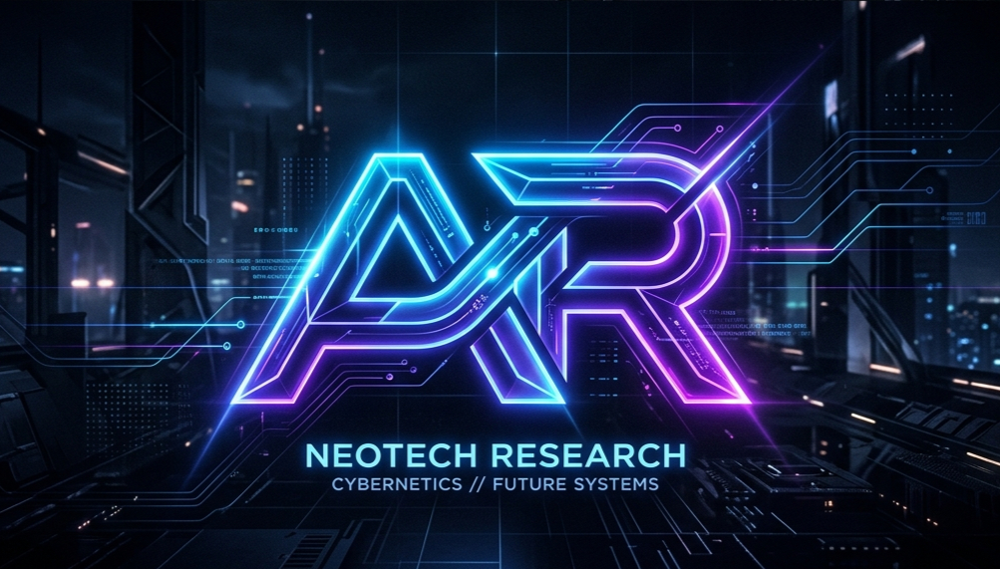

  

<h3 align="center">Building modern, accessible, and high-performance web experiences.</h3>

 

  

 

## 🚀 About Me
I'm a dedicated web developer with a strong foundation in semantic HTML, modern CSS architectures, and JavaScript. I recently completed a rigorous Web Development Internship where I built several production-ready projects from scratch, culminating in a full-stack React deployment. 

I focus on writing clean, modular code, ensuring web accessibility (WCAG), and optimizing applications for peak performance.

## 💻 Tech Stack

  
  
  
  
  
  

## 🏆 Featured Internship Projects

Here are the milestone projects I built during my web development internship:

| Project | Description | Technologies |
|---------|-------------|--------------|
| 🛒 **[E-Commerce Capstone](https://github.com/AnchalRaghav/Full-Stack-Deployment-Project-Architecture)** | A production-ready, modular React SPA with client-side routing and cart state management. | React, Vite, React Router |
| 🌤️ **[Live Weather Dashboard](https://github.com/AnchalRaghav/Asynchronous-JavaScript-RESTful-APIs)** | A real-time weather app utilizing the Fetch API, `async/await`, and Open-Meteo REST APIs. | JavaScript (ES6+), HTML, CSS |
| 📝 **[State-Driven To-Do App](https://github.com/AnchalRaghav/JavaScript-Logic-State-Management)** | An interactive task manager with full CRUD functionality and `window.localStorage` persistence. | Vanilla JS, DOM Manipulation |
| 📱 **[Advanced CSS Layouts](https://github.com/AnchalRaghav/Advanced-CSS3-Responsive-Architecture)** | A responsive grid/flexbox architecture designed for mobile-first user experiences. | CSS3, CSS Grid, Flexbox |
| 🌐 **[Accessible HTML5 Portfolio](https://github.com/AnchalRaghav/HTML5-Semantic-Structure-Accessibility)** | A semantic multi-page portfolio strictly adhering to WCAG accessibility guidelines. | HTML5, ARIA, SEO |

 

## 📈 GitHub Stats

  

 

---

  <i>Let's build something amazing together!</i>

